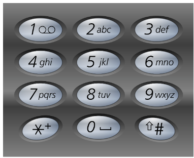

# [17. Letter Combinations of a Phone Number](https://leetcode.com/problems/letter-combinations-of-a-phone-number/)  

### Medium level  

Given a string containing digits from <code>2-9</code> inclusive, return all possible letter combinations that the number could represent. Return the answer in **any order**.

A mapping of digits to letters (just like on the telephone buttons) is given below. Note that 1 does not map to any letters.  
  

**Example 1:**
<pre>
<strong>Input:</strong> digits = "23"
<strong>Output:</strong> ["ad","ae","af","bd","be","bf","cd","ce","cf"]
</pre>

**Example 2:**
<pre>
<strong>Input:</strong> digits = "2"
<strong>Output:</strong> ["a","b","c"]
</pre>  

 

**Constraints:**

* <code>1 <= digits.length <= 4</code>
* <code>digits[i]</code> is a digit in the range <code>['2', '9']</code>.  

