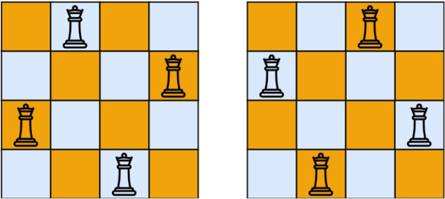

# [52. N-Queens II](https://leetcode.com/problems/n-queens-ii/)  

### Hard level  

The **n-queens** puzzle is the problem of placing <code>n</code> queens on an <code>n x n</code> chessboard such that no two queens attack each other.

Given an integer <code>n</code>, return *the number of distinct solutions to the **n-queens puzzle***.  

 

**Example 1:**  
 
<pre>
<strong>Input:</strong> n = 4
<strong>Output:</strong> 2
<strong>Explanation:</strong> There are two distinct solutions to the 4-queens puzzle as shown.
</pre>

**Example 2:**
<pre>
<strong>Input:</strong> n = 1
<strong>Output:</strong> 1
</pre>

 

**Constraints:**

* <code>1 <= n <= 9</code>  

