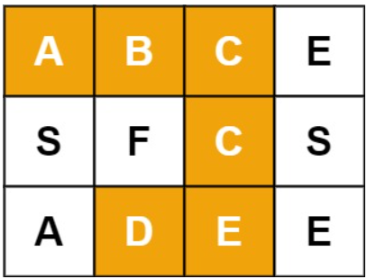
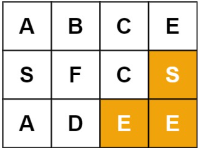
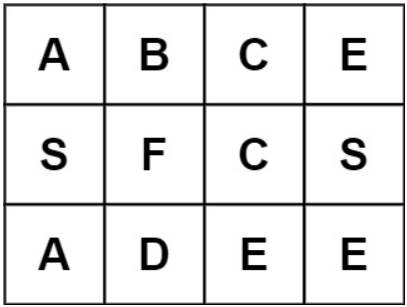

# [79. Word Search](https://leetcode.com/problems/word-search/)  

### Medium level 

Given an <code>m x n</code> grid of characters <code>board</code> and a string <code>word</code>, return <code>true</code> if word *exists in the grid*.

The word can be constructed from letters of sequentially adjacent cells, where adjacent cells are horizontally or vertically neighboring. The same letter cell may not be used more than once.

 

**Example 1:**
  
<pre>
<strong>Input:</strong> board = [["A","B","C","E"],["S","F","C","S"],["A","D","E","E"]], word = "ABCCED"
<strong>Output:</strong> true
</pre>

**Example 2:**
  
<pre>
<strong>Input:</strong> board = [["A","B","C","E"],["S","F","C","S"],["A","D","E","E"]], word = "SEE"
<strong>Output:</strong> true
</pre>

**Example 3:**
  
<pre>
<strong>Input:</strong> board = [["A","B","C","E"],["S","F","C","S"],["A","D","E","E"]], word = "ABCB"
<strong>Output:</strong> false
</pre>

 

**Constraints:**

* <code>m == board.length</code>
* <code>n = board[i].length</code>
* <code>1 <= m, n <= 6</code>
* <code>1 <= word.length <= 15</code>
* <code>board</code> and <code>word</code> consists of only lowercase and uppercase English letters.  

 

**Follow up:** Could you use search pruning to make your solution faster with a larger <code>board</code>?  

