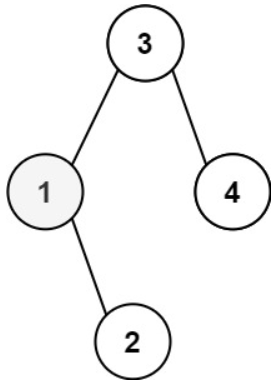
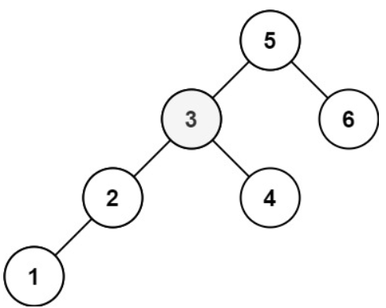

# [230. Kth Smallest Element in a BST](https://leetcode.com/problems/kth-smallest-element-in-a-bst/)  

### Medium level 

Given the <code>root</code> of a binary search tree, and an integer <code>k</code>, return the <code>kth</code> *smallest value (**1-indexed**) of all the values of the nodes in the tree*.  

 

**Example 1:**  

<pre>
<strong>Input:</strong> root = [3,1,4,null,2], k = 1
<strong>Output:</strong> 1
</pre>  

**Example 2:**  

<pre>
<strong>Input:</strong> root = [5,3,6,2,4,null,null,1], k = 3
<strong>Output:</strong> 3
</pre>

 

**Constraints:**

* The number of nodes in the tree is <code>n</code>.
* <code>1 <= k <= n <= 104</code>
* <code>0 <= Node.val <= 104</code>  

 

**Follow up:** If the BST is modified often (i.e., we can do insert and delete operations) and you need to find the kth smallest frequently, how would you optimize?

