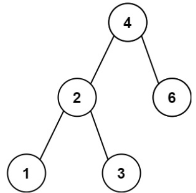
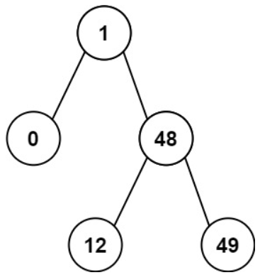

# [530. Minimum Absolute Difference in BST](https://leetcode.com/problems/minimum-absolute-difference-in-bst/)  

### Easy level 

Given the <code>root</code> of a Binary Search Tree (BST), *return the minimum absolute difference between the values of any two different nodes in the tree*.  

 

**Example 1:**  

<pre>
<strong>Input:</strong> root = [4,2,6,1,3]
<strong>Output:</strong> 1
</pre>

**Example 2:**  

<pre>
<strong>Input:</strong> root = [1,0,48,null,null,12,49]
<strong>Output:</strong> 1
</pre>

 

**Constraints:**

* The number of nodes in the tree is in the range <code>[2, 104]</code>.
* <code>0 <= Node.val <= 105</code>  

 

**Note:** This question is the same as 783: [https://leetcode.com/problems/minimum-distance-between-bst-nodes/](https://leetcode.com/problems/minimum-distance-between-bst-nodes/)  

