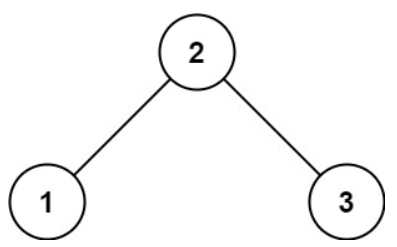
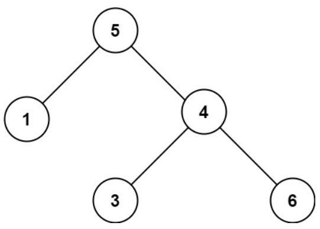

# [98. Validate Binary Search Tree](https://leetcode.com/problems/validate-binary-search-tree/)  

### Medium level 

Given the <code>root</code> of a binary tree, *determine if it is a valid binary search tree (BST)*.

A **valid BST** is defined as follows:

* The left **subtree**1 of a node contains only nodes with keys **strictly less than** the node's key.
* The right subtree of a node contains only nodes with keys **strictly greater than** the node's key.
* Both the left and right subtrees must also be binary search trees.

**1.** A **subtree** of <code>treeName</code> is a tree consisting of a node in <code>treeName</code> and all of its descendants.  

 

**Example 1:**  

<pre>
<strong>Input:</strong> root = [2,1,3]
<strong>Output:</strong> true
</pre>

**Example 2:**  

<pre>
<strong>Input:</strong> root = [5,1,4,null,null,3,6]
<strong>Output:</strong> false
<strong>Explanation:</strong> The root node's value is 5 but its right child's value is 4.
</pre>

 

**Constraints:**

* The number of nodes in the tree is in the range <code>[1, 104]</code>.
* <code>-231 <= Node.val <= 231 - 1</code>  

