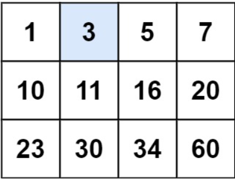
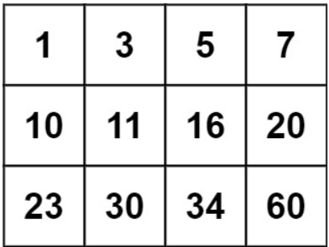

# [74. Search a 2D Matrix](https://leetcode.com/problems/search-a-2d-matrix/)  

### Medium level  

You are given an <code>m x n</code> integer matrix <code>matrix</code> with the following two properties:

* Each row is sorted in non-decreasing order.
* The first integer of each row is greater than the last integer of the previous row.

Given an integer <code>target</code>, return <code>true</code> *if* <code>target</code> *is in* <code>matrix</code> *or* <code>false</code> *otherwise*.

You must write a solution in <code>O(log(m * n))</code> time complexity. 

 

**Example 1:**  

<pre>
<strong>Input:</strong> matrix = [[1,3,5,7],[10,11,16,20],[23,30,34,60]], target = 3
<strong>Output:</strong> true
</pre>

**Example 2:**  

<pre>
<strong>Input:</strong> matrix = [[1,3,5,7],[10,11,16,20],[23,30,34,60]], target = 13
<strong>Output:</strong> false
</pre>

 

**Constraints:**

* <code>m == matrix.length</code>
* <code>n == matrix[i].length</code>
* <code>1 <= m, n <= 100</code>
* <code>-104 <= matrix[i][j], target <= 104</code>  

