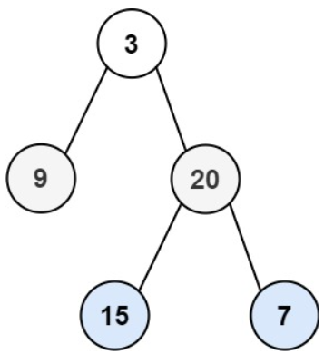

# [102. Binary Tree Level Order Traversal](https://leetcode.com/problems/binary-tree-level-order-traversal/)  

### Medium level  

Given the <code>root</code> of a binary tree, return *the level order traversal of its nodes' values.* (i.e., from left to right, level by level).  

 

**Example 1:**

<pre>
<strong>Input:</strong> root = [3,9,20,null,null,15,7]
<strong>Output:</strong> [[3],[9,20],[15,7]]
</pre>
**Example 2:**
<pre>
<strong>Input:</strong> root = [1]
<strong>Output:</strong> [[1]]
</pre>
**Example 3:**
<pre>
<strong>Input:</strong> root = []
<strong>Output:</strong> []
</pre>

 

**Constraints:**

* The number of nodes in the tree is in the range <code>[0, 2000]</code>.
* <code>-1000 <= Node.val <= 1000</code>

