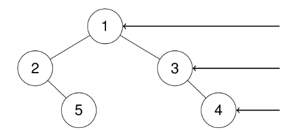
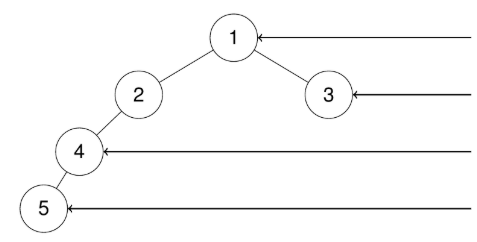

# [199. Binary Tree Right Side View](https://leetcode.com/problems/binary-tree-right-side-view/)  

### Medium level 

Given the <code>root</code> of a binary tree, imagine yourself standing on the **right side** of it, return *the values of the nodes you can see ordered from top to bottom*.

 

**Example 1:**
<pre>
<strong>Input:</strong> root = [1,2,3,null,5,null,4]
<strong>Output:</strong> [1,3,4]
</pre>
**Explanation:**

**Example 2:**
<pre>
<strong>Input:</strong> root = [1,2,3,4,null,null,null,5]
<strong>Output:</strong> [1,3,4,5]
</pre>
**Explanation:**

**Example 3:**
<pre>
<strong>Input:</strong> root = [1,null,3]
<strong>Output:</strong> [1,3]
</pre>
**Example 4:**
<pre>
<strong>Input:</strong>root = []
<strong>Output:</strong> []
</pre>

 

**Constraints:**

* The number of nodes in the tree is in the range <code>[0, 100]</code>.
* <code>-100 <= Node.val <= 100</code>

