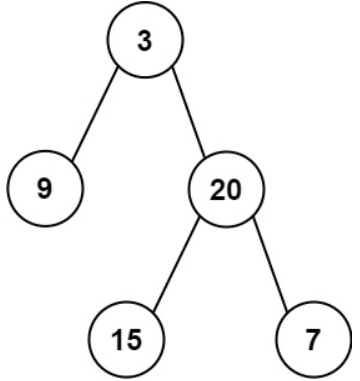
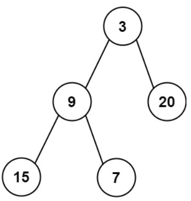

# [637. Average of Levels in Binary Tree](https://leetcode.com/problems/average-of-levels-in-binary-tree/)  

### Easy level 

Given the <code>root</code> of a binary tree, return *the average value of the nodes on each level in the form of an array*. Answers within <code>10-5</code> of the actual answer will be accepted.  

 

**Example 1:**

<pre>
<strong>Input:</strong> root = [3,9,20,null,null,15,7]
<strong>Output:</strong> [3.00000,14.50000,11.00000]
<strong>Explanation:</strong> The average value of nodes on level 0 is 3, on level 1 is 14.5, and on level 2 is 11.
Hence return [3, 14.5, 11].
</pre>

**Example 2:**

<pre>
<strong>Input:</strong> root = [3,9,20,15,7]
<strong>Output:</strong> [3.00000,14.50000,11.00000]
</pre>

 

**Constraints:**

* The number of nodes in the tree is in the range <code>[1, 104]</code>.
* <code>-231 <= Node.val <= 231 - 1</code>  

