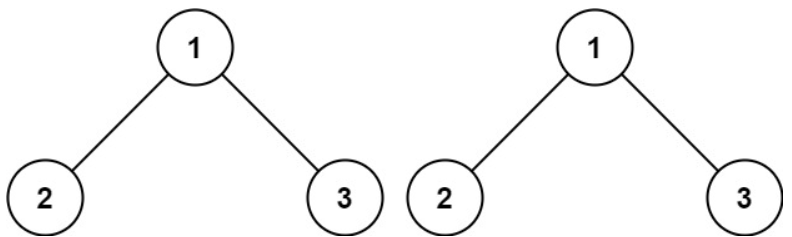
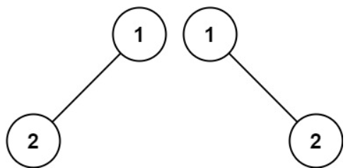
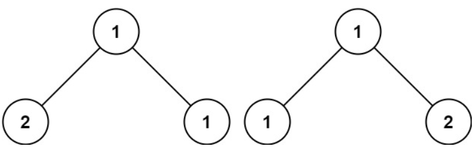

# [100. Same Tree](https://leetcode.com/problems/same-tree/)  

### Easy level 

Given the roots of two binary trees <code>p</code> and <code>q</code>, write a function to check if they are the same or not.

Two binary trees are considered the same if they are structurally identical, and the nodes have the same value.  

 

**Example 1:**

<pre>
<strong>Input:</strong> p = [1,2,3], q = [1,2,3]
<strong>Output:</strong> true
</pre>

**Example 2:**

<pre>
<strong>Input:</strong> p = [1,2], q = [1,null,2]
<strong>Output:</strong> false
</pre>

**Example 3:**

<pre>
<strong>Input:</strong> p = [1,2,1], q = [1,1,2]
<strong>Output:</strong> false
</pre>

 

**Constraints:**

* The number of nodes in both trees is in the range <code>[0, 100]</code>.
* <code>-104 <= Node.val <= 104</code>  

