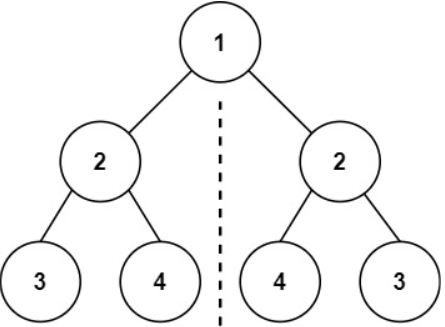
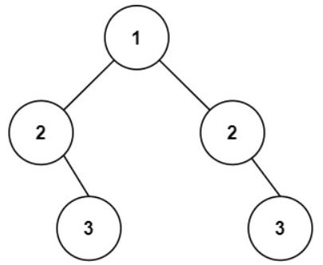

# [101. Symmetric Tree](https://leetcode.com/problems/symmetric-tree/)  

### Easy level 

Given the <code>root</code> of a binary tree, *check whether it is a mirror of itself* (i.e., symmetric around its center).  

 

**Example 1:**

<pre>
<strong>Input:</strong> root = [1,2,2,3,4,4,3]
<strong>Output:</strong> true
</pre>
**Example 2:**

<pre>
<strong>Input:</strong> root = [1,2,2,null,3,null,3]
<strong>Output:</strong> false
</pre>

 

**Constraints:**

* The number of nodes in the tree is in the range <code>[1, 1000]</code>.
* <code>-100 <= Node.val <= 100</code>  

