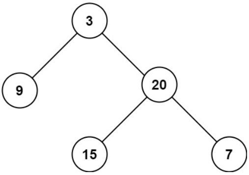

# [104. Maximum Depth of Binary Tree](https://leetcode.com/problems/maximum-depth-of-binary-tree/)  

### Easy level 

Given the <code>root</code> of a binary tree, return *its maximum depth*.

A binary tree's **maximum depth** is the number of nodes along the longest path from the root node down to the farthest leaf node.  

 

**Example 1:**

<pre>
<strong>Input:</strong> root = [3,9,20,null,null,15,7]
<strong>Output:</strong> 3 
</pre>
**Example 2:**
<pre>
<strong>Input:</strong> root = [1,null,2]
<strong>Output:</strong> 2
</pre>  

 

**Constraints:**

* The number of nodes in the tree is in the range <code>[0, 104]</code>.
* <code>-100 <= Node.val <= 100</code>  

