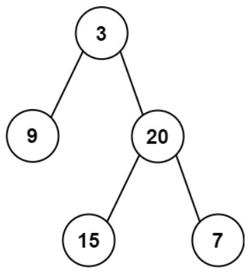

# [105. Construct Binary Tree from Preorder and Inorder Traversal](https://leetcode.com/problems/construct-binary-tree-from-preorder-and-inorder-traversal/)  

### Medium level  

Given two integer arrays <code>preorder</code> and <code>inorder</code> where <code>preorder</code> is the preorder traversal of a binary tree and <code>inorder</code> is the inorder traversal of the same tree, construct and return *the binary tree*. 

 

**Example 1:** 

<pre>
<strong>Input:</strong> preorder = [3,9,20,15,7], inorder = [9,3,15,20,7]
<strong>Output:</strong> [3,9,20,null,null,15,7]
</pre>
**Example 2:**
<pre>
<strong>Input:</strong> preorder = [-1], inorder = [-1]
<strong>Output:</strong> [-1]
</pre>

 

**Constraints:**

* <code>1 <= preorder.length <= 3000</code>
* <code>inorder.length == preorder.length</code>
* <code>-3000 <= preorder[i], inorder[i] <= 3000</code>
* <code>preorder</code> and <code>inorder</code> consist of **unique** values.
* Each value of <code>inorder</code> also appears in <code>preorder</code>.
* <code>preorder</code> is **guaranteed** to be the preorder traversal of the tree.
* <code>inorder</code> is **guaranteed** to be the inorder traversal of the tree.  

