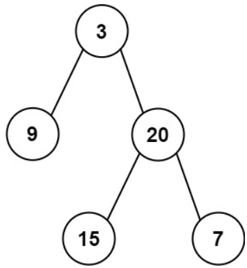

# [106. Construct Binary Tree from Inorder and Postorder Traversal](https://leetcode.com/problems/construct-binary-tree-from-inorder-and-postorder-traversal/)  

### Medium level  

Given two integer arrays <code>inorder</code> and <code>postorder</code> where <code>inorder</code> is the inorder traversal of a binary tree and <code>postorder</code> is the postorder traversal of the same tree, construct and return *the binary tree*.  

 

**Example 1:**

<pre>
<strong>Input:</strong> inorder = [9,3,15,20,7], postorder = [9,15,7,20,3]
<strong>Output:</strong> [3,9,20,null,null,15,7]
</pre>
**Example 2:**
<pre>
<strong>Input:</strong> inorder = [-1], postorder = [-1]
<strong>Output:</strong> [-1]
</pre>  

 

**Constraints:**

* <code>1 <= inorder.length <= 3000</code>
* <code>postorder.length == inorder.length</code>
* <code>-3000 <= inorder[i], postorder[i] <= 3000</code>
* <code>inorder</code> and <code>postorder</code> consist of **unique** values.
* Each value of <code>postorder</code> also appears in <code>inorder</code>.
* <code>inorder</code> is **guaranteed** to be the inorder traversal of the tree.
* <code>postorder</code> is **guaranteed** to be the postorder traversal of the tree.  

