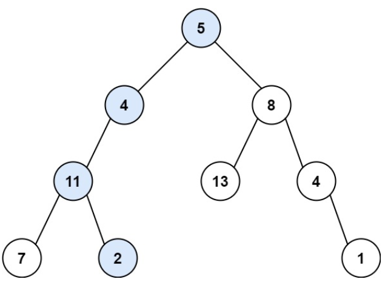
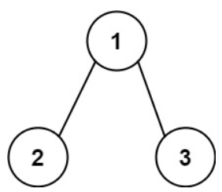

# [112. Path Sum](https://leetcode.com/problems/path-sum/)  

### Easy level  

Given the <code>root</code> of a binary tree and an integer <code>targetSum</code>, return <code>true</code> if the tree has a **root-to-leaf** path such that adding up all the values along the path equals <code>targetSum</code>.

A **leaf** is a node with no children.  

 

**Example 1:**

<pre>
<strong>Input:</strong> root = [5,4,8,11,null,13,4,7,2,null,null,null,1], targetSum = 22
<strong>Output:</strong> true
<strong>Explanation:</strong> The root-to-leaf path with the target sum is shown.
</pre>
**Example 2:**

<pre>
<strong>Input:</strong> root = [1,2,3], targetSum = 5
<strong>Output:</strong> false
<strong>Explanation:</strong> There are two root-to-leaf paths in the tree:
(1 --> 2): The sum is 3.
(1 --> 3): The sum is 4.
There is no root-to-leaf path with sum = 5.
</pre>
**Example 3:**
<pre>
<strong>Input:</strong> root = [], targetSum = 0
<strong>Output:</strong> false
<strong>Explanation:</strong> Since the tree is empty, there are no root-to-leaf paths.
</pre>  

 

**Constraints:**

* The number of nodes in the tree is in the range <code>[0, 5000]</code>.
* <code>-1000 <= Node.val <= 1000</code>
* <code>-1000 <= targetSum <= 1000</code>  

