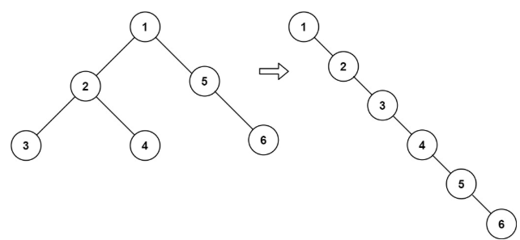

# [114. Flatten Binary Tree to Linked List](https://leetcode.com/problems/flatten-binary-tree-to-linked-list/)  

### Medium level  

Given the <code>root</code> of a binary tree, flatten the tree into a "linked list":

* The "linked list" should use the same <code>TreeNode</code> class where the <code>right</code> child pointer points to the next node in the list and the <code>left</code> child pointer is always <code>null</code>.
* The "linked list" should be in the same order as a **pre-order traversal** of the binary tree.  

 

**Example 1:**

<pre>
<strong>Input:</strong> root = [1,2,5,3,4,null,6]
<strong>Output:</strong> [1,null,2,null,3,null,4,null,5,null,6]
</pre>
**Example 2:**
<pre>
<strong>Input:</strong> root = []
<strong>Output:</strong> []
</pre>
**Example 3:**
<pre>
<strong>Input:</strong> root = [0]
<strong>Output:</strong> [0]
</pre>

 

**Constraints:**

* The number of nodes in the tree is in the range <code>[0, 2000]</code>.
* <code>-100 <= Node.val <= 100</code>

 

**Follow up:** Can you flatten the tree in-place (with <code>O(1)</code> extra space)?

