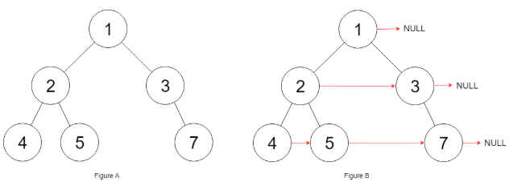

# [117. Populating Next Right Pointers in Each Node II](https://leetcode.com/problems/populating-next-right-pointers-in-each-node-ii/)  

### Medium level 

Given a binary tree

```C++ 
struct Node {
  int val;
  Node *left;
  Node *right;
  Node *next;
}
```
Populate each next pointer to point to its next right node. If there is no next right node, the next pointer should be set to <code>NULL</code>.

Initially, all next pointers are set to <code>NULL</code>.  

<br />

**Example 1:**

<pre>
<strong>Input:</strong> root = [1,2,3,4,5,null,7]
<strong>Output:</strong> [1,#,2,3,#,4,5,7,#]
<strong>Explanation:</strong> Given the above binary tree (Figure A), your function should populate each next pointer to point to its next right node, just like in Figure B. The serialized output is in level order as connected by the next pointers, with '#' signifying the end of each level.
</pre>
**Example 2:**
<pre>
<strong>Input:</strong> root = []
<strong>Output:</strong> []
</pre>  

<br />

**Constraints:**

* The number of nodes in the tree is in the range <code>[0, 6000]</code>.
* <code>-100 <= Node.val <= 100</code>

<br />

**Follow-up:**

* You may only use constant extra space.
* The recursive approach is fine. You may assume implicit stack space does not count as extra space for this problem.  

