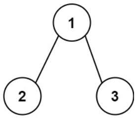
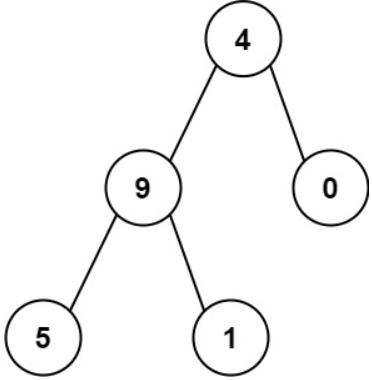

# [129. Sum Root to Leaf Numbers](https://leetcode.com/problems/sum-root-to-leaf-numbers/)  

### Medium level  

You are given the <code>root</code> of a binary tree containing digits from <code>0</code> to <code>9</code> only.

Each root-to-leaf path in the tree represents a number.

* For example, the root-to-leaf path <code>1 -> 2 -> 3</code> represents the number <code>123</code>.
Return *the total sum of all root-to-leaf numbers*. Test cases are generated so that the answer will fit in a **32-bit** integer.

A **leaf** node is a node with no children.  

 

**Example 1:**

<pre>
<strong>Input:</strong> root = [1,2,3]
<strong>Output:</strong> 25
</pre>
**Explanation:**  
The root-to-leaf path <code>1->2</code> represents the number <code>12</code>.  
The root-to-leaf path <code>1->3</code> represents the number <code>13</code>.  
Therefore, sum = 12 + 13 = <code>25</code>.  

**Example 2:**

<pre>
<strong>Input:</strong> root = [4,9,0,5,1]
<strong>Output:</strong> 1026
</pre>
**Explanation:**
The root-to-leaf path <code>4->9->5</code> represents the number <code>495</code>.  
The root-to-leaf path <code>4->9->1</code> represents the number <code>491</code>.  
The root-to-leaf path <code>4->0</code> represents the number <code>40</code>.  
Therefore, sum = 495 + 491 + 40 = <code>1026</code>.  

 

**Constraints:**

* The number of nodes in the tree is in the range <code>[1, 1000]</code>.
* <code>0 <= Node.val <= 9</code>
* The depth of the tree will not exceed <code>10</code>.  

