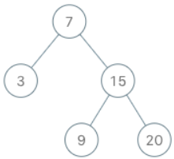

# [173. Binary Search Tree Iterator](https://leetcode.com/problems/binary-search-tree-iterator/)  

### Medium level  

Implement the <code>BSTIterator</code> class that represents an iterator over the [in-order traversal](https://en.wikipedia.org/wiki/Tree_traversal#In-order_(LNR)) of a binary search tree (BST):

* <code>BSTIterator(TreeNode root)</code> Initializes an object of the <code>BSTIterator</code> class. The <code>root</code> of the BST is given as part of the constructor. The pointer should be initialized to a non-existent number smaller than any element in the BST.
* <code>boolean hasNext()</code> Returns <code>true</code> if there exists a number in the traversal to the right of the pointer, otherwise returns <code>false</code>.
* <code>int next()</code> Moves the pointer to the right, then returns the number at the pointer.

Notice that by initializing the pointer to a non-existent smallest number, the first call to <code>next()</code> will return the smallest element in the BST.

You may assume that <code>next()</code> calls will always be valid. That is, there will be at least a next number in the in-order traversal when <code>next()</code> is called.  

 

**Example 1:**

<pre>
<strong>Input</strong>
["BSTIterator", "next", "next", "hasNext", "next", "hasNext", "next", "hasNext", "next", "hasNext"]
[[[7, 3, 15, null, null, 9, 20]], [], [], [], [], [], [], [], [], []]
<strong>Output</strong>
[null, 3, 7, true, 9, true, 15, true, 20, false]

<strong>Explanation</strong>
BSTIterator bSTIterator = new BSTIterator([7, 3, 15, null, null, 9, 20]);
bSTIterator.next();    // return 3
bSTIterator.next();    // return 7
bSTIterator.hasNext(); // return True
bSTIterator.next();    // return 9
bSTIterator.hasNext(); // return True
bSTIterator.next();    // return 15
bSTIterator.hasNext(); // return True
bSTIterator.next();    // return 20
bSTIterator.hasNext(); // return False
</pre>  

 

**Constraints:**

* The number of nodes in the tree is in the range <code>[1, 105]</code>.
* <code>0 <= Node.val <= 106</code>
* At most <code>105</code> calls will be made to <code>hasNext</code>, and <code>next</code>.  

 

**Follow up:**

* Could you implement <code>next()</code> and <code>hasNext()</code> to run in average <code>O(1)</code> time and use <code>O(h)</code> memory, where <code>h</code> is the height of the tree?  

