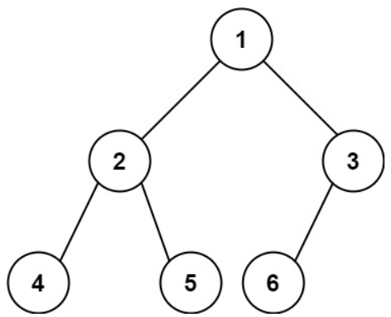

# [222. Count Complete Tree Nodes](https://leetcode.com/problems/count-complete-tree-nodes/)  

### Medium level  

Given the <code>root</code> of a **complete** binary tree, return the number of the nodes in the tree.

According to [Wikipedia](https://en.wikipedia.org/wiki/Binary_tree#Types_of_binary_trees), every level, except possibly the last, is completely filled in a complete binary tree, and all nodes in the last level are as far left as possible. It can have between <code>1</code> and <code>2h</code> nodes inclusive at the last level <code>h</code>.

Design an algorithm that runs in less than <code>O(n)</code> time complexity.  

 

**Example 1:**

<pre>
<strong>Input:</strong> root = [1,2,3,4,5,6]
<strong>Output:</strong> 6
</pre>
**Example 2:**
<pre>
<strong>Input:</strong> root = []
<strong>Output:</strong> 0
</pre>
**Example 3:**
<pre>
<strong>Input:</strong> root = [1]
<strong>Output:</strong> 1
</pre>

 

**Constraints:**

* The number of nodes in the tree is in the range <code>[0, 5 * 104]</code>.
* <code>0 <= Node.val <= 5 * 104</code>
* The tree is guaranteed to be **complete**.