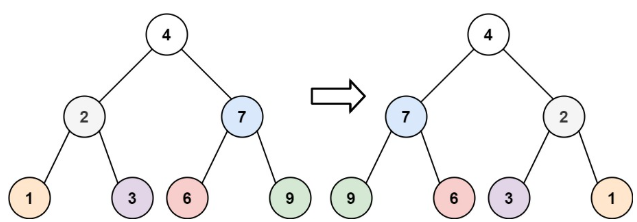
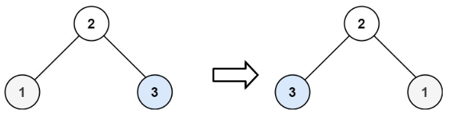

# [226. Invert Binary Tree](https://leetcode.com/problems/invert-binary-tree/)  

### Easy level  

Given the <code>root</code> of a binary tree, invert the tree, and return *its* root.

 

**Example 1:**

<pre>
<strong>Input:</strong> root = [4,2,7,1,3,6,9]
<strong>Output:</strong> [4,7,2,9,6,3,1]
</pre>
**Example 2:**

<pre>
<strong>Input:</strong> root = [2,1,3]
<strong>Output:</strong> [2,3,1]
</pre>
**Example 3:**
<pre>
<strong>Input:</strong> root = []
<strong>Output:</strong> []
</pre>  

 

**Constraints:**

* The number of nodes in the tree is in the range <code>[0, 100]</code>.
* <code>-100 <= Node.val <= 100</code>  

