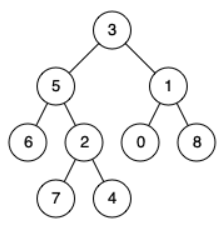

# [236. Lowest Common Ancestor of a Binary Tree](https://leetcode.com/problems/lowest-common-ancestor-of-a-binary-tree/)  

### Medium level  

Given a binary tree, find the lowest common ancestor (LCA) of two given nodes in the tree.

According to the [definition of LCA on Wikipedia](https://en.wikipedia.org/wiki/Lowest_common_ancestor): “The lowest common ancestor is defined between two nodes <code>p</code> and <code>q</code> as the lowest node in <code>T</code> that has both <code>p</code> and <code>q</code> as descendants (where we allow **a node to be a descendant of itself**).”  

 

**Example 1:**

<pre>
<strong>Input:</strong> root = [3,5,1,6,2,0,8,null,null,7,4], p = 5, q = 1
<strong>Output:</strong> 3
<strong>Explanation:</strong> The LCA of nodes 5 and 1 is 3.
</pre>
**Example 2:**  

<pre>
<strong>Input:</strong> root = [3,5,1,6,2,0,8,null,null,7,4], p = 5, q = 4
<strong>Output:</strong> 5
<strong>Explanation:</strong> The LCA of nodes 5 and 4 is 5, since a node can be a descendant of itself according to the LCA definition.
</pre>
**Example 3:**
<pre>
<strong>Input:</strong> root = [1,2], p = 1, q = 2
<strong>Output:</strong> 1
</pre>  

 

**Constraints:**

* The number of nodes in the tree is in the range <code>[2, 105]</code>.
* <code>-109 <= Node.val <= 109</code>
* All <code>Node.val</code> are **unique**.
* <code>p != q</code>
* <code>p</code> and <code>q</code> will exist in the tree.