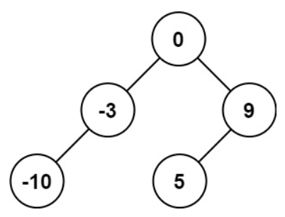
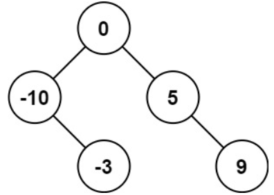
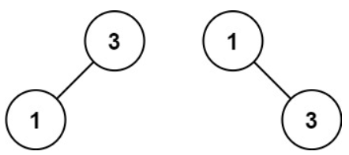

# [108. Convert Sorted Array to Binary Search Tree](https://leetcode.com/problems/convert-sorted-array-to-binary-search-tree/)  

### Easy level  

Given an integer array <code>nums</code> where the elements are sorted in **ascending order**, convert *it to a **height-balanced1** binary search tree*.  

**1.** A **height-balanced** binary tree is a binary tree in which the depth of the two subtrees of every node never differs by more than one.  

 

**Example 1:**  
  
<pre>
<strong>Input:</strong> nums = [-10, -3, 0, 5, 9]
<strong>Output:</strong> [0, -3, 9, -10, null, 5]
</pre>
**Explanation:** [0, -10, 5, null, -3, null, 9] is also accepted:  

 

**Example 2:**  
  
<pre>
<strong>Input:</strong> nums = [1, 3]
<strong>Output:</strong> [3, 1]
<strong>Explanation:</strong> [1, null, 3] and [3, 1] are both height-balanced BSTs.
</pre> 

 

**Constraints:**

* <code>1 <= nums.length <= 104</code>
* <code>-104 <= nums[i] <= 104</code>
* <code>nums</code> is sorted in a **strictly increasing** order.  

