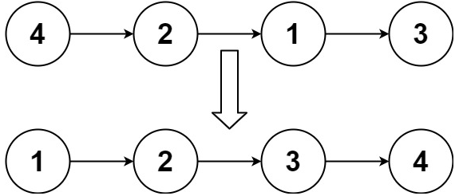
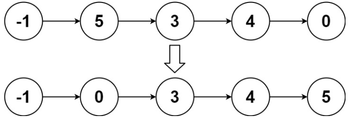

# [148. Sort List](https://leetcode.com/problems/sort-list/)  

### Medium level  

Given the <code>head</code> of a linked list, return *the list after sorting it in **ascending order***.  

 

**Example 1:**
  
<pre>
<strong>Input:</strong> head = [4,2,1,3]
<strong>Output:</strong> [1,2,3,4]
</pre>

**Example 2:**
  
<pre>
<strong>Input:</strong> head = [-1,5,3,4,0]
<strong>Output:</strong> [-1,0,3,4,5]  
</pre>

**Example 3:**
<pre>
<strong>Input:</strong> head = []
<strong>Output:</strong> []
</pre>

 

**Constraints:**

* The number of nodes in the list is in the range <code>[0, 5 * 104]</code>.
* <code>-105 <= Node.val <= 105</code>

 

**Follow up:** Can you sort the linked list in <code>O(n logn)</code> time and <code>O(1)</code> memory (i.e. constant space)?  

