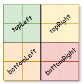
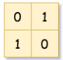
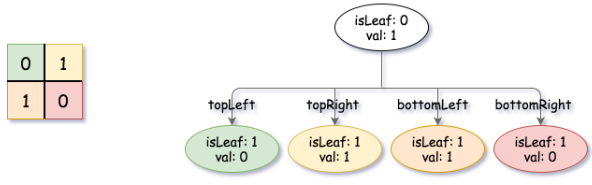
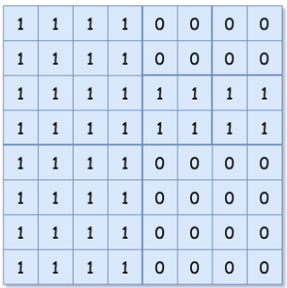
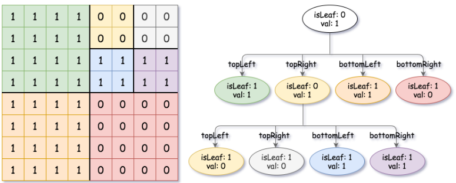

# [427. Construct Quad Tree](https://leetcode.com/problems/construct-quad-tree/)  

### Medium level 

Given a <code>n * n</code> matrix <code>grid</code> of <code>0's</code> and <code>1's</code> only. We want to represent <code>grid</code> with a Quad-Tree.

Return *the root of the Quad-Tree representing* <code>grid</code>.

A Quad-Tree is a tree data structure in which each internal node has exactly four children. Besides, each node has two attributes:

* <code>val</code>: True if the node represents a grid of 1's or False if the node represents a grid of 0's. Notice that you can assign the <code>val</code> to True or False when <code>isLeaf</code> is False, and both are accepted in the answer.
* <code>isLeaf</code>: True if the node is a leaf node on the tree or False if the node has four children.  

```C++
class Node {
    public boolean val;
    public boolean isLeaf;
    public Node topLeft;
    public Node topRight;
    public Node bottomLeft;
    public Node bottomRight;
}
```

We can construct a Quad-Tree from a two-dimensional area using the following steps:

1. If the current grid has the same value (i.e all <code>1's</code> or all <code>0's</code>) set <code>isLeaf</code> True and set <code>val</code> to the value of the grid and set the four children to Null and stop.
2. If the current grid has different values, set <code>isLeaf</code> to False and set <code>val</code> to any value and divide the current grid into four sub-grids as shown in the photo.
3. Recurse for each of the children with the proper sub-grid.  
  
If you want to know more about the Quad-Tree, you can refer to the [wiki](https://en.wikipedia.org/wiki/Quadtree).  

**Quad-Tree format:**

You don't need to read this section for solving the problem. This is only if you want to understand the output format here. The output represents the serialized format of a Quad-Tree using level order traversal, where <code>null</code> signifies a path terminator where no node exists below.

It is very similar to the serialization of the binary tree. The only difference is that the node is represented as a list <code>[isLeaf, val]</code>.

If the value of <code>isLeaf</code> or <code>val</code> is True we represent it as **1** in the list <code>[isLeaf, val]</code> and if the value of <code>isLeaf</code> or <code>val</code> is False we represent it as **0**.  

<br />

**Example 1:**  
  
<pre>
<strong>Input:</strong> grid = [[0,1],[1,0]]
<strong>Output:</strong> [[0,1],[1,0],[1,1],[1,1],[1,0]]
</pre>
**Explanation:** The explanation of this example is shown below:
Notice that 0 represents False and 1 represents True in the photo representing the Quad-Tree.
  

**Example 2:**  
  
<pre>
<strong>Input:</strong> grid = [[1,1,1,1,0,0,0,0],[1,1,1,1,0,0,0,0],[1,1,1,1,1,1,1,1],[1,1,1,1,1,1,1,1],[1,1,1,1,0,0,0,0],[1,1,1,1,0,0,0,0],[1,1,1,1,0,0,0,0],[1,1,1,1,0,0,0,0]]
<strong>Output:</strong> [[0,1],[1,1],[0,1],[1,1],[1,0],null,null,null,null,[1,0],[1,0],[1,1],[1,1]]
</pre>
**Explanation:** All values in the grid are not the same. We divide the grid into four sub-grids.
The topLeft, bottomLeft and bottomRight each has the same value.
The topRight have different values so we divide it into 4 sub-grids where each has the same value.
Explanation is shown in the photo below:
  

<br />

**Constraints:**

* <code>n == grid.length == grid[i].length</code>
* <code>n == 2<sup>x</sup></code> where <code>0 <= x <= 6</code>

