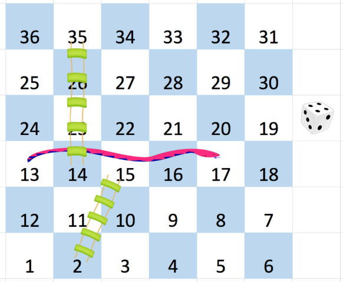

# [909. Snakes and Ladders](https://leetcode.com/problems/snakes-and-ladders/)  

### Medium level  

You are given an <code>n x n</code> integer matrix <code>board</code> where the cells are labeled from <code>1</code> to <code>n2</code> in a [Boustrophedon style](https://en.wikipedia.org/wiki/Boustrophedon) starting from the bottom left of the board (i.e. <code>board[n - 1][0]</code>) and alternating direction each row.

You start on square <code>1</code> of the board. In each move, starting from square <code>curr</code>, do the following:

* Choose a destination square <code>next</code> with a label in the range <code>[curr + 1, min(curr + 6, n2)]</code>.
* This choice simulates the result of a standard **6-sided die roll**: i.e., there are always at most 6 destinations, regardless of the size of the board.
* If <code>next</code> has a snake or ladder, you **must** move to the destination of that snake or ladder. Otherwise, you move to <code>next</code>.
* The game ends when you reach the square <code>n2</code>.  

A board square on row <code>r</code> and column <code>c</code> has a snake or ladder if <code>board[r][c] != -1</code>. The destination of that snake or ladder is <code>board[r][c]</code>. Squares <code>1</code> and <code>n2</code> are not the starting points of any snake or ladder.

Note that you only take a snake or ladder at most once per dice roll. If the destination to a snake or ladder is the start of another snake or ladder, you do **not** follow the subsequent snake or ladder.

* For example, suppose the board is <code>[[-1,4],[-1,3]]</code>, and on the first move, your destination square is <code>2</code>. You follow the ladder to square <code>3</code>, but do **not** follow the subsequent ladder to <code>4</code>.  

Return *the least number of dice rolls required to reach the square* <code>n2</code>*. If it is not possible to reach the square, return* <code>-1</code>.  

 

**Example 1:**

<pre>
<strong>Input:</strong> board = [[-1,-1,-1,-1,-1,-1],[-1,-1,-1,-1,-1,-1],[-1,-1,-1,-1,-1,-1],[-1,35,-1,-1,13,-1],[-1,-1,-1,-1,-1,-1],[-1,15,-1,-1,-1,-1]]
<strong>Output:</strong> 4
<strong>Explanation:</strong> 
In the beginning, you start at square 1 (at row 5, column 0).
You decide to move to square 2 and must take the ladder to square 15.
You then decide to move to square 17 and must take the snake to square 13.
You then decide to move to square 14 and must take the ladder to square 35.
You then decide to move to square 36, ending the game.
This is the lowest possible number of moves to reach the last square, so return 4.
</pre>

**Example 2:**
<pre>
<strong>Input:</strong> board = [[-1,-1],[-1,3]]
<strong>Output:</strong> 1
</pre>  

 

**Constraints:**

* <code>n == board.length == board[i].length</code>
* <code>2 <= n <= 20</code>
* <code>board[i][j]</code> is either <code>-1</code> or in the range <code>[1, n2]</code>.
* The squares labeled <code>1</code> and <code>n2</code> are not the starting points of any snake or ladder.  

