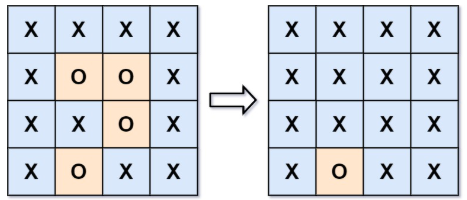

# [130. Surrounded Regions](https://leetcode.com/problems/surrounded-regions/)  

### Medium level 

You are given an <code>m x n</code> matrix <code>board</code> containing **letters** <code>'X'</code> and <code>'O'</code>, **capture regions** that are surrounded:

* **Connect**: A cell is connected to adjacent cells horizontally or vertically.
* **Region**: To form a region **connect every** <code>'O'</code> cell.
* **Surround**: A region is surrounded if none of the <code>'O'</code> cells in that region are on the edge of the board. Such regions are **completely enclosed** by <code>'X'</code> cells.  

To capture a **surrounded region**, replace all <code>'O'</code>s with <code>'X'</code>s **in-place** within the original board. You do not need to return anything.  

 

**Example 1:**
<pre>
<strong>Input:</strong> board = [["X","X","X","X"],["X","O","O","X"],["X","X","O","X"],["X","O","X","X"]]
<strong>Output:</strong> [["X","X","X","X"],["X","X","X","X"],["X","X","X","X"],["X","O","X","X"]]
</pre>
**Explanation:**

In the above diagram, the bottom region is not captured because it is on the edge of the board and cannot be surrounded.

**Example 2:**
<pre>
<strong>Input:</strong> board = [["X"]]
<strong>Output:</strong> [["X"]]
</pre>

 

**Constraints:**

* <code>m == board.length</code>
* <code>n == board[i].length</code>
* <code>1 <= m, n <= 200</code>
* <code>board[i][j]</code> is <code>'X'</code> or <code>'O'</code>.

