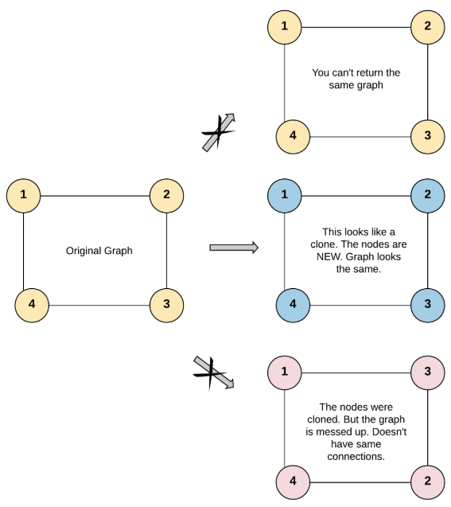
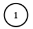

# [133. Clone Graph](https://leetcode.com/problems/clone-graph/)  

### Medium level 

Given a reference of a node in a **connected** undirected graph.

Return a **deep copy** (clone) of the graph.

Each node in the graph contains a value (<code>int</code>) and a list (<code>List[Node]</code>) of its neighbors.

```C++
class Node {
    public int val;
    public List<Node> neighbors;
}
```
 
**Test case format:**

For simplicity, each node's value is the same as the node's index (1-indexed). For example, the first node with <code>val == 1</code>, the second node with <code>val == 2</code>, and so on. The graph is represented in the test case using an adjacency list.

**An adjacency list** is a collection of unordered **lists** used to represent a finite graph. Each list describes the set of neighbors of a node in the graph.

The given node will always be the first node with <code>val = 1</code>. You must return the **copy of the given node** as a reference to the cloned graph.  

<br />

**Example 1:**

<pre>
<strong>Input:</strong> adjList = [[2,4],[1,3],[2,4],[1,3]]  
<strong>Output:</strong> [[2,4],[1,3],[2,4],[1,3]]  
<strong>Explanation:</strong> There are 4 nodes in the graph.  
1st node (val = 1)'s neighbors are 2nd node (val = 2) and 4th node (val = 4).  
2nd node (val = 2)'s neighbors are 1st node (val = 1) and 3rd node (val = 3).  
3rd node (val = 3)'s neighbors are 2nd node (val = 2) and 4th node (val = 4).  
4th node (val = 4)'s neighbors are 1st node (val = 1) and 3rd node (val = 3).  
</pre>

**Example 2:**  

<pre>
<strong>Input:</strong> adjList = [[]]
<strong>Output</strong> [[]]
<strong>Explanation:</strong> Note that the input contains one empty list. The graph consists of only one node with val = 1 and it does not have any neighbors.
</pre>  

**Example 3:**
<pre>
<strong>Input:</strong> adjList = []
<strong>Output:</strong> []
<strong>Explanation:</strong> This an empty graph, it does not have any nodes.
</pre>

<br />

**Constraints:**

* The number of nodes in the graph is in the range <code>[0, 100]</code>.
* <code>1 <= Node.val <= 100</code>
* <code>Node.val</code> is unique for each node.
* There are no repeated edges and no self-loops in the graph.
* The Graph is connected and all nodes can be visited starting from the given node.  

