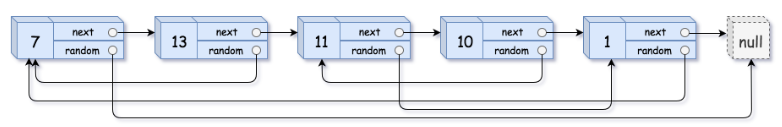
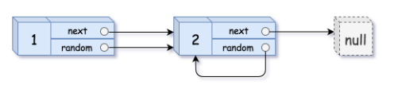
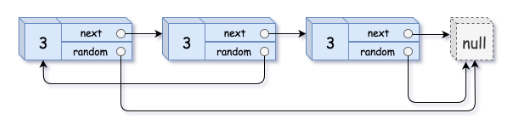

# [138. Copy List with Random Pointer](https://leetcode.com/problems/copy-list-with-random-pointer/)  

### Medium level 

A linked list of length <code>n</code> is given such that each node contains an additional random pointer, which could point to any node in the list, or <code>null</code>.

Construct a **deep copy** of the list. The deep copy should consist of exactly <code>n</code> **brand new** nodes, where each new node has its value set to the value of its corresponding original node. Both the <code>next</code> and <code>random</code> pointer of the new nodes should point to new nodes in the copied list such that the pointers in the original list and copied list represent the same list state. **None of the pointers in the new list should point to nodes in the original list**.

For example, if there are two nodes <code>X</code> and <code>Y</code> in the original list, where <code>X.random --> Y</code>, then for the corresponding two nodes <code>x</code> and <code>y</code> in the copied list, <code>x.random --> y</code>.

Return *the head of the copied linked list*.

The linked list is represented in the input/output as a list of n nodes. Each node is represented as a pair of <code>[val, random_index]</code> where:

* <code>val</code>: an integer representing <code>Node.val</code>
* <code>random_index</code>: the index of the node (range from <code>0</code> to <code>n-1</code>) that the <code>random</code> pointer points to, or <code>null</code> if it does not point to any node.  

Your code will **only** be given the <code>head</code> of the original linked list.  

 

**Example 1:**

<pre>
<strong>Input:</strong> head = [[7,null],[13,0],[11,4],[10,2],[1,0]]
<strong>Output:</strong> [[7,null],[13,0],[11,4],[10,2],[1,0]]
</pre>
**Example 2:**

<pre>
<strong>Input:</strong> head = [[1,1],[2,1]]
<strong>Output:</strong> [[1,1],[2,1]]
</pre>
**Example 3:**

<pre>
<strong>Input:</strong> head = [[3,null],[3,0],[3,null]]
<strong>Output:</strong> [[3,null],[3,0],[3,null]]
</pre>  

 

**Constraints:**

* <code>0 <= n <= 1000</code>
* <code>-104 <= Node.val <= 104</code>
* <code>Node.random</code> is <code>null</code> or is pointing to some node in the linked list.  

