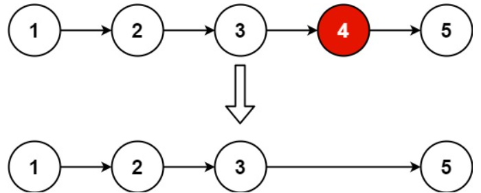

# [19. Remove Nth Node From End of List](https://leetcode.com/problems/remove-nth-node-from-end-of-list/)  

### Medium level  

Given the <code>head</code> of a linked list, remove the <code>nth</code> node from the end of the list and return its head.  

 

**Example 1:**

<pre>
<strong>Input:</strong> head = [1,2,3,4,5], n = 2
<strong>Output:</strong> [1,2,3,5]
</pre>
**Example 2:**
<pre>
<strong>Input:</strong> head = [1], n = 1
<strong>Output:</strong> []
</pre>
**Example 3:**
<pre>
<strong>Input:</strong> head = [1,2], n = 1
<strong>Output:</strong> [1]
</pre>  

 

**Constraints:**

* The number of nodes in the list is <code>sz</code>.
* <code>1 <= sz <= 30</code>
* <code>0 <= Node.val <= 100</code>
* <code>1 <= n <= sz</code>  

 

**Follow up:** Could you do this in one pass?  

