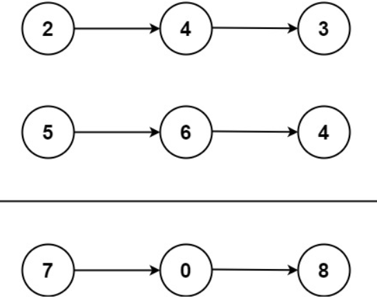

# [2. Add Two Numbers](https://leetcode.com/problems/add-two-numbers/)  

### Medium level  

You are given two **non-empty** linked lists representing two non-negative integers. The digits are stored in **reverse order**, and each of their nodes contains a single digit. Add the two numbers and return the sum as a linked list.

You may assume the two numbers do not contain any leading zero, except the number 0 itself.  

 

**Example 1:**

<pre>
<strong>Input:</strong> l1 = [2,4,3], l2 = [5,6,4]
<strong>Output:</strong> [7,0,8]
<strong>Explanation:</strong> 342 + 465 = 807.
</pre>

**Example 2:**
<pre>
<strong>Input:</strong> l1 = [0], l2 = [0]
<strong>Output:</strong> [0]
</pre>

**Example 3:**
<pre>
<strong>Input:</strong> l1 = [9,9,9,9,9,9,9], l2 = [9,9,9,9]
<strong>Output:</strong> [8,9,9,9,0,0,0,1]
</pre>

 

**Constraints:**

* The number of nodes in each linked list is in the range <code>[1, 100]</code>.
* <code>0 <= Node.val <= 9</code>
* It is guaranteed that the list represents a number that does not have leading zeros.  

