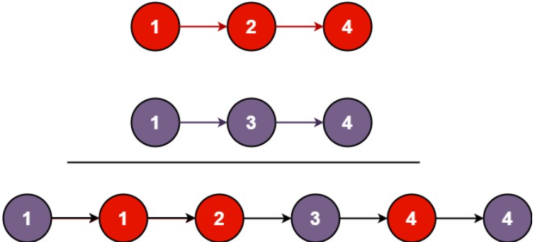

# [21. Merge Two Sorted Lists](https://leetcode.com/problems/merge-two-sorted-lists/)  

### EAsy level  

You are given the heads of two sorted linked lists <code>list1</code> and <code>list2</code>.

Merge the two lists into one **sorted** list. The list should be made by splicing together the nodes of the first two lists.

Return *the head of the merged linked list*. 

 

**Example 1:**

<pre>
<strong>Input:</strong> list1 = [1,2,4], list2 = [1,3,4]
<strong>Output:</strong> [1,1,2,3,4,4]
</pre>

**Example 2:**
<pre>
<strong>Input:</strong> list1 = [], list2 = []
<strong>Output:</strong> []
</pre>
**Example 3:**
<pre>
<strong>Input:</strong> list1 = [], list2 = [0]
<strong>Output:</strong> [0]
</pre>

 

**Constraints:**

* The number of nodes in both lists is in the range <code>[0, 50]</code>.
* <code>-100 <= Node.val <= 100</code>
* Both <code>list1</code> and <code>list2</code> are sorted in **non-decreasing** order.  

