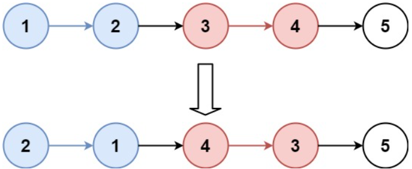
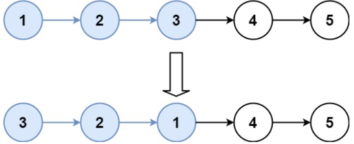

# [25. Reverse Nodes in k-Group](https://leetcode.com/problems/reverse-nodes-in-k-group/)  

### Hard level

Given the <code>head</code> of a linked list, reverse the nodes of the list k at a time, and return *the modified list*.

<code>k</code> is a positive integer and is less than or equal to the length of the linked list. If the number of nodes is not a multiple of <code>k</code> then left-out nodes, in the end, should remain as it is.

You may not alter the values in the list's nodes, only nodes themselves may be changed.  

 

**Example 1:**

<pre>
<strong>Input:</strong> head = [1,2,3,4,5], k = 2
<strong>Output:</strong> [2,1,4,3,5]
</pre>

**Example 2:**

<pre>
<strong>Input:</strong> head = [1,2,3,4,5], k = 3
<strong>Output:</strong> [3,2,1,4,5]
</pre>

 

**Constraints:**

* The number of nodes in the list is <code>n</code>.
* <code>1 <= k <= n <= 5000</code>
* <code>0 <= Node.val <= 1000</code>  

 

**Follow-up:** Can you solve the problem in <code>O(1)</code> extra memory space?  

