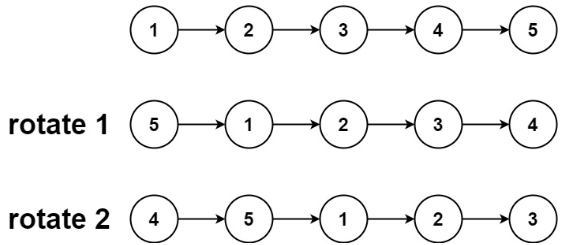
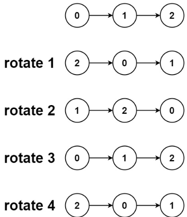

# [61. Rotate List](https://leetcode.com/problems/rotate-list/)  

### Medium level  

Given the <code>head</code> of a linked list, rotate the list to the right by <code>k</code> places.  

 

**Example 1:**

<pre>
<strong>Input:</strong> head = [1,2,3,4,5], k = 2
<strong>Output:</strong> [4,5,1,2,3]
</pre>
**Example 2:**

<pre>
<strong>Input:</strong> head = [0,1,2], k = 4
<strong>Output:</strong> [2,0,1]
</pre>

 

**Constraints:**

* The number of nodes in the list is in the range <code>[0, 500]</code>.
* <code>-100 <= Node.val <= 100</code>
* <code>0 <= k <= 2 * 109</code>

