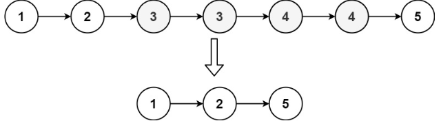
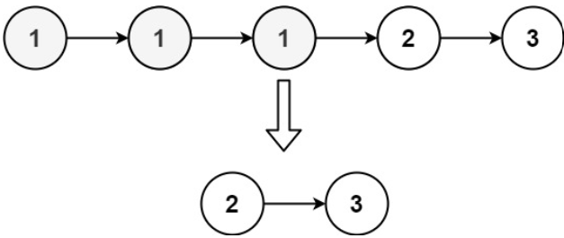

# [82. Remove Duplicates from Sorted List II](https://leetcode.com/problems/remove-duplicates-from-sorted-list-ii/)  

### Medium level 

Given the <code>head</code> of a sorted linked list, *delete all nodes that have duplicate numbers, leaving only distinct numbers from the original list. Return the linked list **sorted** as well*.

 

**Example 1:**

<pre>
<strong>Input:</strong> head = [1,2,3,3,4,4,5]
<strong>Output:</strong> [1,2,5]
</pre>

**Example 1:**

<pre>
<strong>Input:</strong> head = [1,1,1,2,3]
<strong>Output:</strong> [2,3]
</pre>

 

**Constraints:**

* The number of nodes in the list is in the range <code>[0, 300]</code>.
* <code>-100 <= Node.val <= 100</code>
* The list is guaranteed to be **sorted** in ascending order. 

