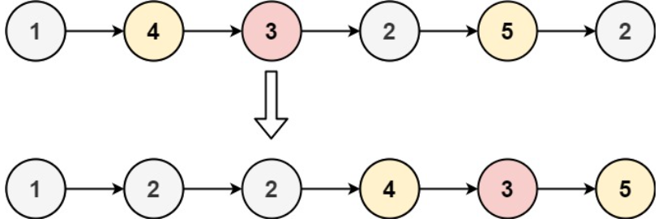

# [86. Partition List](https://leetcode.com/problems/partition-list/)  

### Medium level  

Given the <code>head</code> of a linked list and a value <code>x</code>, partition it such that all nodes **less than** <code>x</code> come before nodes **greater than or equal** to <code>x</code>.

You should **preserve** the original relative order of the nodes in each of the two partitions.  

 

**Example 1:**

<pre>
<strong>Input:</strong> head = [1,4,3,2,5,2], x = 3
<strong>Output:</strong> [1,2,2,4,3,5]
</pre>
**Example 2:**
<pre>
<strong>Input:</strong> head = [2,1], x = 2
<strong>Output:</strong> [1,2]
</pre>

 

**Constraints:**

* The number of nodes in the list is in the range <code>[0, 200]</code>.
* <code>-100 <= Node.val <= 100</code>
* <code>-200 <= x <= 200</code>  

