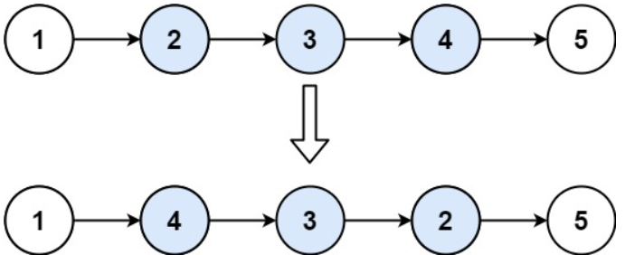

# [92. Reverse Linked List II](https://leetcode.com/problems/reverse-linked-list-ii/)  

### Medium level  

Given the <code>head</code> of a singly linked list and two integers <code>left</code> and <code>right</code> where <code>left <= right</code>, reverse the nodes of the list from position <code>left</code> to position <code>right</code>, and return the *reversed list*.

 

**Example 1:**

<pre>
<strong>Input:</strong> head = [1,2,3,4,5], left = 2, right = 4
<strong>Output:</strong> [1,4,3,2,5]
</pre>
**Example 2:**
<pre>
<strong>Input:</strong> head = [5], left = 1, right = 1
<strong>Output:</strong> [5]
</pre>

 

**Constraints:**

* The number of nodes in the list is <code>n</code>.
* <code>1 <= n <= 500</code>
* <code>-500 <= Node.val <= 500</code>
* <code>1 <= left <= right <= n</code>

 

**Follow up:** Could you do it in one pass?

