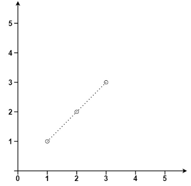
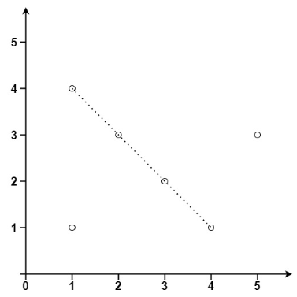

# [149. Max Points on a Line](https://leetcode.com/problems/max-points-on-a-line/)  

### Hard level  

Given an array of <code>points</code> where <code>points[i] = [xi, yi]</code> represents a point on the **X-Y** plane, return *the maximum number of points that lie on the same straight line*.  

 

**Example 1:**
  
<pre>
<strong>Input:</strong> points = [[1,1],[2,2],[3,3]]
<strong>Output:</strong> 3
</pre>

**Example 2:**
  
<pre>
<strong>Input:</strong> points = [[1,1],[3,2],[5,3],[4,1],[2,3],[1,4]]
<strong>Output:</strong> 4
</pre>

 

**Constraints:**

* <code>1 <= points.length <= 300</code>
* <code>points[i].length == 2</code>
* <code>-104 <= xi, yi <= 104</code>
* All the <code>points</code> are **unique**.  

