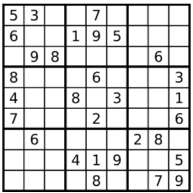

# [36. Valid Sudoku](https://leetcode.com/problems/valid-sudoku/description/)  

### Medium level  

Determine if a <code>9 x 9</code> Sudoku board is valid. Only the filled cells need to be validated **according to the following rules**:

1. Each row must contain the digits <code>1-9</code> without repetition.
2. Each column must contain the digits <code>1-9</code> without repetition.
3. Each of the nine <code>3 x 3</code> sub-boxes of the grid must contain the digits <code>1-9</code> without repetition.  

**Note:**

* A Sudoku board (partially filled) could be valid but is not necessarily solvable.
* Only the filled cells need to be validated according to the mentioned rules.  

 

**Example 1:**

 

<pre>
<strong>Input:</strong> board = 
[["5","3",".",".","7",".",".",".","."]
,["6",".",".","1","9","5",".",".","."]
,[".","9","8",".",".",".",".","6","."]
,["8",".",".",".","6",".",".",".","3"]
,["4",".",".","8",".","3",".",".","1"]
,["7",".",".",".","2",".",".",".","6"]
,[".","6",".",".",".",".","2","8","."]
,[".",".",".","4","1","9",".",".","5"]
,[".",".",".",".","8",".",".","7","9"]]
<strong>Output:</strong> true
</pre>  

**Example 2:**
<pre>
<strong>Input:</strong> board = 
[["8","3",".",".","7",".",".",".","."]
,["6",".",".","1","9","5",".",".","."]
,[".","9","8",".",".",".",".","6","."]
,["8",".",".",".","6",".",".",".","3"]
,["4",".",".","8",".","3",".",".","1"]
,["7",".",".",".","2",".",".",".","6"]
,[".","6",".",".",".",".","2","8","."]
,[".",".",".","4","1","9",".",".","5"]
,[".",".",".",".","8",".",".","7","9"]]
<strong>Output:</strong> false
<strong>Explanation:</strong> Same as Example 1, except with the <strong>5</strong> in the top left corner being modified to <strong>8</strong>. Since there are two 8's in the top left 3x3 sub-box, it is invalid.
</pre>

 

**Constraints:**

* <code>board.length == 9</code>
* <code>board[i].length == 9</code>
* <code>board[i][j]</code> is a digit <code>1-9</code> or <code>'.'</code>.  

