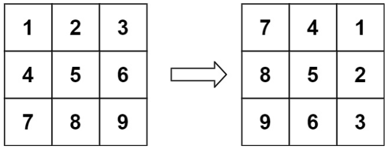
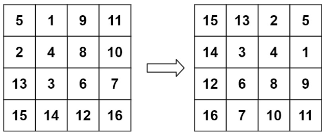

# [48. Rotate Image](https://leetcode.com/problems/rotate-image/)  

### Medium level  

You are given an <code>n x n</code> 2D <code>matrix</code> representing an image, rotate the image by **90** degrees (clockwise).

You have to rotate the image **in-place**, which means you have to modify the input 2D matrix directly. **DO NOT** allocate another 2D matrix and do the rotation.  

 

**Example 1:**

<pre>
<strong>Input:</strong> matrix = [[1,2,3],[4,5,6],[7,8,9]]
<strong>Output:</strong> [[7,4,1],[8,5,2],[9,6,3]]
</pre>  

**Example 2:**

<pre>
<strong>Input:</strong> matrix = [[5,1,9,11],[2,4,8,10],[13,3,6,7],[15,14,12,16]]
<strong>Output:</strong> [[15,13,2,5],[14,3,4,1],[12,6,8,9],[16,7,10,11]]
</pre> 

 

**Constraints:**

* <code>n == matrix.length == matrix[i].length</code>
* <code>1 <= n <= 20</code>
* <code>-1000 <= matrix[i][j] <= 1000</code>  

