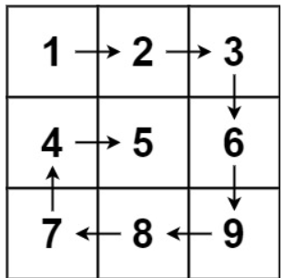
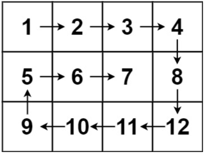

# [54. Spiral Matrix](https://leetcode.com/problems/spiral-matrix/)  

### Medium level  

Given an <code>m x n</code> <code>matrix</code>, return *all elements of the* <code>matrix</code> *in spiral order*.

 

**Example 1:**

<pre>
<strong>Input:</strong> matrix = [[1,2,3],[4,5,6],[7,8,9]]
<strong>Output:</strong> [1,2,3,6,9,8,7,4,5]
</pre>

**Example 2:**

<pre>
<strong>Input:</strong> matrix = [[1,2,3,4],[5,6,7,8],[9,10,11,12]]
<strong>Output:</strong> [1,2,3,4,8,12,11,10,9,5,6,7]
</pre>  

 

**Constraints:**

* <code>m == matrix.length</code>
* <code>n == matrix[i].length</code>
* <code>1 <= m, n <= 10</code>
* <code>-100 <= matrix[i][j] <= 100</code>  

