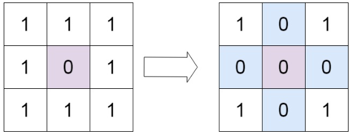
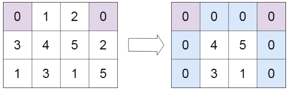

# [73. Set Matrix Zeroes](https://leetcode.com/problems/set-matrix-zeroes/)  

### Medium level  

Given an <code>m x n</code> integer matrix <code>matrix</code>, if an element is <code>0</code>, set its entire row and column to <code>0</code>'s.

You must do it **in place**. 

 

**Example 1:**
  
<pre>
<strong>Input:</strong> matrix = [[1,1,1],[1,0,1],[1,1,1]]
<strong>Output:</strong> [[1,0,1],[0,0,0],[1,0,1]]
</pre>  

**Example 2:**
  
<pre>
<strong>Input:</strong> matrix = [[0,1,2,0],[3,4,5,2],[1,3,1,5]]
<strong>Output:</strong> [[0,0,0,0],[0,4,5,0],[0,3,1,0]]
</pre>

 

**Constraints:**

* <code>m == matrix.length</code>
* <code>n == matrix[0].length</code>
* <code>1 <= m, n <= 200</code>
* <code>-231 <= matrix[i][j] <= 231 - 1</code>  

 

**Follow up:**

* A straightforward solution using <code>O(mn)</code> space is probably a bad idea.
* A simple improvement uses <code>O(m + n)</code> space, but still not the best solution.
* Could you devise a constant space solution?  

