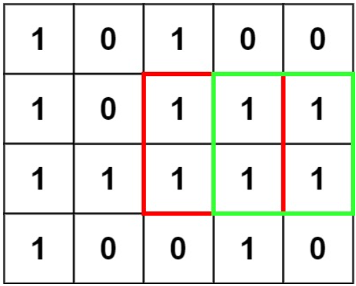
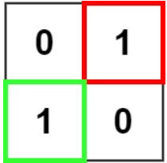

# [221. Maximal Square](https://leetcode.com/problems/maximal-square/)  

### Medium level 

Given an <code>m x n</code> binary <code>matrix</code> filled with <code>0</code>'s and <code>1</code>'s, *find the largest square containing only* <code>1</code>'s *and return its area*.

 

**Example 1:**  
 
<pre>
<strong>Input:</strong> matrix = [["1","0","1","0","0"],["1","0","1","1","1"],["1","1","1","1","1"],["1","0","0","1","0"]]
<strong>Output:</strong> 4
</pre>

**Example 2:**  
 
<pre>
<strong>Input:</strong> matrix = [["0","1"],["1","0"]]
<strong>Output:</strong> 1
</pre>

**Example 3:**
<pre>
<strong>Input:</strong> matrix = [["0"]]
<strong>Output:</strong> 0
</pre>

 

**Constraints:**

* <code>m == matrix.length</code>
* <code>n == matrix[i].length</code>
* <code>1 <= m, n <= 300</code>
* <code>matrix[i][j]</code> is <code>'0'</code> or <code>'1'</code>.  

