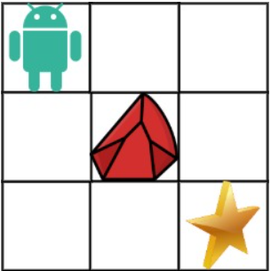
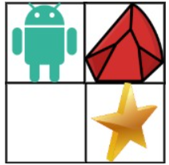

# [63. Unique Paths II](https://leetcode.com/problems/unique-paths-ii/)  

### Medium level  

You are given an <code>m x n</code> integer array <code>grid</code>. There is a robot initially located at the **top-left corner** (i.e., <code>grid[0][0]</code>). The robot tries to move to the **bottom-right corner** (i.e., <code>grid[m - 1][n - 1]</code>). The robot can only move either down or right at any point in time.

An obstacle and space are marked as <code>1</code> or <code>0</code> respectively in <code>grid</code>. A path that the robot takes cannot include **any** square that is an obstacle.

Return *the number of possible unique paths that the robot can take to reach the bottom-right corner*.

The testcases are generated so that the answer will be less than or equal to <code>2 * 109</code>.  

 

**Example 1:**  
  
<pre>
<strong>Input:</strong> obstacleGrid = [[0,0,0],[0,1,0],[0,0,0]]
<strong>Output:</strong> 2
<strong>Explanation:</strong> There is one obstacle in the middle of the 3x3 grid above.
There are two ways to reach the bottom-right corner:
1. Right -> Right -> Down -> Down
2. Down -> Down -> Right -> Right
</pre>

**Example 2:**  
  
<pre>
<strong>Input:</strong> obstacleGrid = [[0,1],[0,0]]
<strong>Output:</strong> 1
</pre>

 

**Constraints:**

* <code>m == obstacleGrid.length</code>
* <code>n == obstacleGrid[i].length</code>
* <code>1 <= m, n <= 100</code>
* <code>obstacleGrid[i][j]</code> is <code>0</code> or <code>1</code>.  

