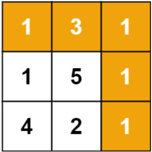

# [64. Minimum Path Sum](https://leetcode.com/problems/minimum-path-sum/)  

### Medium level  

Given a <code>m x n</code> <code>grid</code> filled with non-negative numbers, find a path from top left to bottom right, which minimizes the sum of all numbers along its path.

**Note:** You can only move either down or right at any point in time.

 

**Example 1:**  

<pre>
<strong>Input:</strong> grid = [[1,3,1],[1,5,1],[4,2,1]]
<strong>Output:</strong> 7
<strong>Explanation:</strong> Because the path 1 → 3 → 1 → 1 → 1 minimizes the sum.
</pre>

**Example 2:**
<pre>
<strong>Input:</strong> grid = [[1,2,3],[4,5,6]]
<strong>Output:</strong> 12
</pre>

 

**Constraints:**

* <code>m == grid.length</code>
* <code>n == grid[i].length</code>
* <code>1 <= m, n <= 200</code>
* <code>0 <= grid[i][j] <= 200</code>  

