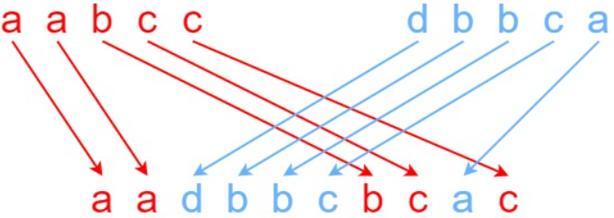

# [97. Interleaving String](https://leetcode.com/problems/interleaving-string/)  

### Medium level 

Given strings <code>s1</code>, <code>s2</code>, and <code>s3</code>, find whether <code>s3</code> is formed by an interleaving of <code>s1</code> and <code>s2</code>.

An interleaving of two strings <code>s</code> and <code>t</code> is a configuration where <code>s</code> and <code>t</code> are divided into <code>n</code> and <code>m</code> substrings respectively, such that:

* <code>s = s1 + s2 + ... + sn</code>
* <code>t = t1 + t2 + ... + tm</code>
* <code>|n - m| <= 1</code>  
* The interleaving is <code>s1 + t1 + s2 + t2 + s3 + t3 + ... or t1 + s1 + t2 + s2 + t3 + s3 + ...</code>  

Note: <code>a + b</code> is the concatenation of strings <code>a</code> and <code>b</code>.  

 

**Example 1:**  
 
<pre>
<strong>Input:</strong> s1 = "aabcc", s2 = "dbbca", s3 = "aadbbcbcac"
<strong>Output:</strong> true
<strong>Explanation:</strong> One way to obtain s3 is:
Split s1 into s1 = "aa" + "bc" + "c", and s2 into s2 = "dbbc" + "a".
Interleaving the two splits, we get "aa" + "dbbc" + "bc" + "a" + "c" = "aadbbcbcac".
Since s3 can be obtained by interleaving s1 and s2, we return true.
</pre>

**Example 2:**
<pre>
<strong>Input:</strong> s1 = "aabcc", s2 = "dbbca", s3 = "aadbbbaccc"
<strong>Output:</strong> false
<strong>Explanation:</strong> Notice how it is impossible to interleave s2 with any other string to obtain s3.
</pre>

**Example 3:**
<pre>
<strong>Input:</strong s1 = "", s2 = "", s3 = ""
<strong>Output:</strong> true
</pre>

 

**Constraints:**

* <code>0 <= s1.length, s2.length <= 100</code>
* <code>0 <= s3.length <= 200</code>
* <code>s1</code>, <code>s2</code>, and <code>s3</code> consist of lowercase English letters. 

 

**Follow up:** Could you solve it using only <code>O(s2.length)</code> additional memory space?  

