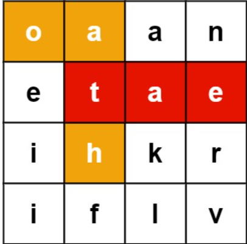
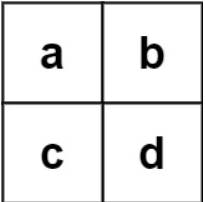

# [212. Word Search II](https://leetcode.com/problems/word-search-ii/)  

### Hard level 

Given an <code>m x n</code> <code>board</code> of characters and a list of strings <code>words</code>, return *all words on the board*.

Each word must be constructed from letters of sequentially adjacent cells, where **adjacent cells** are horizontally or vertically neighboring. The same letter cell may not be used more than once in a word.  

**Example 1:**

<pre>
<strong>Input:</strong> board = [["o","a","a","n"],["e","t","a","e"],["i","h","k","r"],["i","f","l","v"]], words = ["oath","pea","eat","rain"]
<strong>Output:</strong> ["eat","oath"]
</pre>

**Example 2:**  

<pre>
<strong>Input:</strong> board = [["a","b"],["c","d"]], words = ["abcb"]
<strong>Output:</strong> []
</pre>

 

**Constraints:**

* <code>m == board.length</code>
* <code>n == board[i].length</code>
* <code>1 <= m, n <= 12</code>
* <code>board[i][j]</code> is a lowercase English letter.
* <code>1 <= words.length <= 3 * 104</code>
* <code>1 <= words[i].length <= 10</code>
* <code>words[i]</code> consists of lowercase English letters.
* All the strings of <code>words</code> are unique.  

