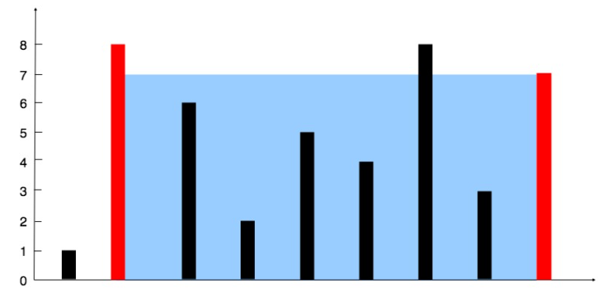

# [11. Container With Most Water](https://leetcode.com/problems/container-with-most-water/)  

### Medium level 

You are given an integer array <code>height</code> of length <code>n</code>. There are <code>n</code> vertical lines drawn such that the two endpoints of the <code>ith</code> line are <code>(i, 0)</code> and <code>(i, height[i])</code>.

Find two lines that together with the x-axis form a container, such that the container contains the most water.

Return *the maximum amount of water a container can store*.

**Notice** that you may not slant the container.  

 

**Example 1:**  

 

<pre>
<strong>Input:</strong> height = [1,8,6,2,5,4,8,3,7]
<strong>Output:</strong> 49
<strong>Explanation:</strong> The above vertical lines are represented by array [1,8,6,2,5,4,8,3,7].  
In this case, the max area of water (blue section) the container can contain is 49.
</pre>  

**Example 2:**
<pre>
<strong>Input:</strong> height = [1,1]
<strong>Output:</strong> 1
</pre>  

 

**Constraints:**

* <code>n == height.length</code>
* <code>2 <= n <= 105</code>
* <code>0 <= height[i] <= 104</code>  

